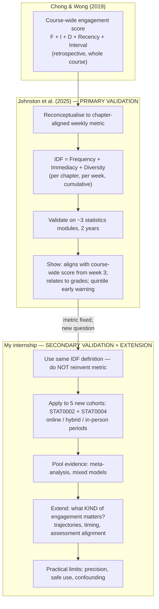
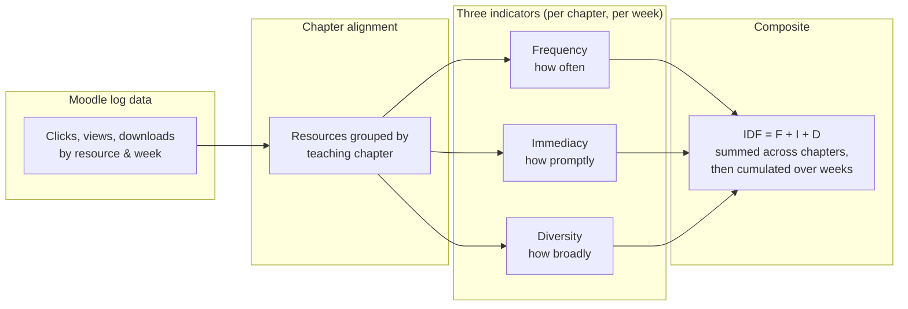
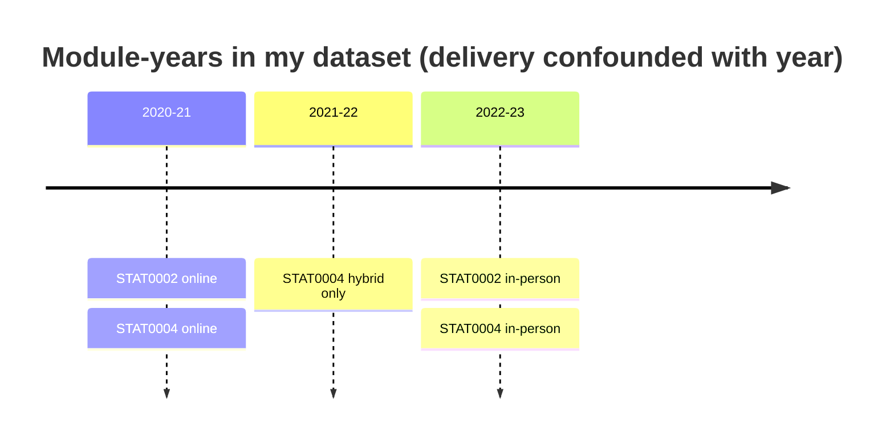
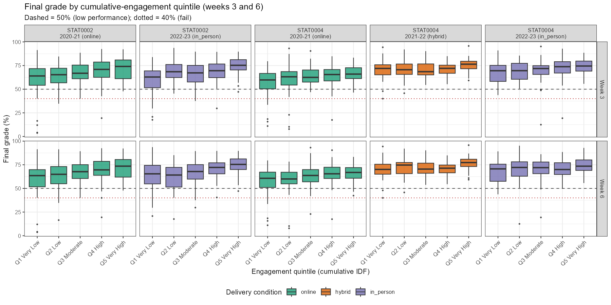
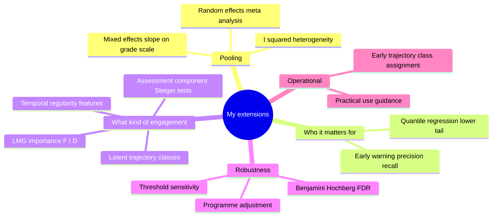
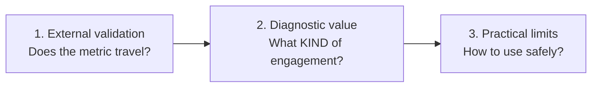
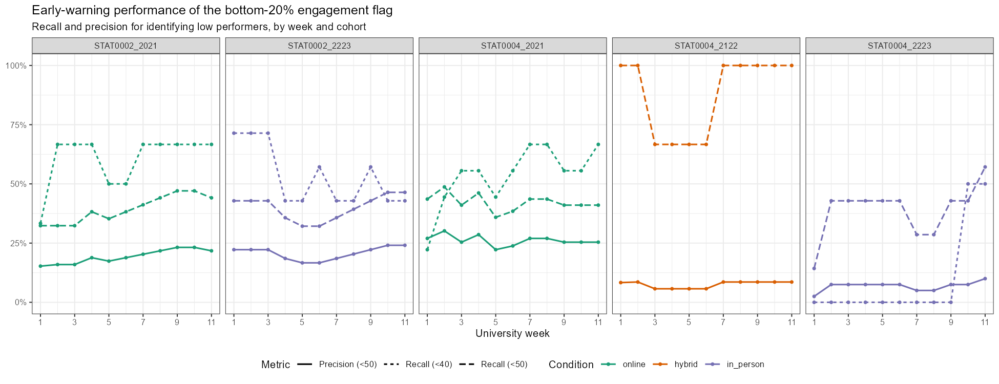

# Professor's Research vs My Research — A Clear Comparison

**Purpose:** A presentation guide for discussing my internship work with Professor Johnston and colleagues.  
**Professor's paper:** Johnston, L. J., Griffin, J. E., Manolopoulou, I., & Jendoubi, T. (2025). *A real-time metric of online engagement monitoring.* [arXiv:2507.12162](https://arxiv.org/abs/2507.12162)  
**My report:** *Validating and Extending a Chapter-Aligned Moodle Engagement Metric Across STAT0002 and STAT0004* (`report/report.pdf`)

---

## 1. The one-sentence difference

| | Summary |
|---|---|
| **Professor Johnston et al.** | **Develops** a new chapter-aligned real-time engagement metric from Moodle logs and **validates** that it tracks the older course-wide score and relates to final grades in structured statistics modules. |
| **My research** | **Takes that metric as fixed** and asks: when applied to **new STAT0002/STAT0004 cohorts** (including COVID-era and post-COVID delivery periods), how **portable**, **interpretable**, and **safe to use** is it for student support? |

**In plain English:** The professor built and first-validated the tool. I tested whether the same tool still works on different years/modules, what kind of engagement it actually measures, and how staff should (and should not) use it in practice.

---

## 2. Visual overview

### 2.1 How the two projects relate



### 2.2 Shared metric (what stays identical)

Both projects use the **same additive chapter-aligned formulation**:

```
Per chapter, per week:
    chapter_score = Frequency + Immediacy + Diversity   (min-max scaled within cohort/week)

Per student, per week:
    IDF_week = sum of chapter scores released so far that week

Cumulative:
    cum_IDF = sum of IDF_week from week 1 to week t
```



**Important:** My analysis verified the supplied data match this additive definition (not multiplicative). I cite Johnston et al. as the source of the metric; my contribution is **not** metric invention.

---

## 3. Side-by-side comparison table

| Dimension | Johnston et al. (2025) | My research (internship) |
|-----------|------------------------|---------------------------|
| **Main goal** | Design + first validation of a real-time chapter-aligned metric | Secondary validation + diagnostic extension on new cohorts |
| **Metric role** | **Creates** the metric from Chong & Wong (2019) | **Applies** the existing metric unchanged |
| **Modules** | Three undergraduate statistics modules (incl. structured lecture modules; weaker in less structured courses) | **STAT0002** (1st year) and **STAT0004** (2nd year) at UCL |
| **Cohorts / years** | Two academic years in original validation | **Five cohorts** spanning **2020–21 to 2022–23** (online, hybrid, in-person periods) |
| **Sample size** | As reported in paper (multiple module-years) | **N = 1,291** students with valid grades and engagement |
| **Delivery conditions** | Compared across module contexts | Online, hybrid, in-person — but **confounded with academic year** (not a causal delivery experiment) |
| **Core analyses** | Correlation with course-wide score; weekly correlation with grades; quintile separation; recall at midpoint vs end | **Replicates** core analyses **plus** pooled meta-analysis, quantile regression, LMG decomposition, assessment-component tests, temporal features, latent trajectories, robustness checks |
| **Pooling across cohorts** | Module-by-module reporting | **Random-effects meta-analysis** (pooled *r*, *I²*) + **mixed-effects** slope (~3.8 grade points per SD) |
| **Early warning** | Bottom quintile identifies many low performers by midpoint | Confirms similar pattern; quantifies **precision ~15–26%** for failure — most flagged students still pass |
| **New diagnostic work** | Focus on composite validity | **What kind** of engagement matters: Diversity/Immediacy > Frequency; trajectory classes; exam vs peer alignment |
| **Main headline result** | Metric is real-time, interpretable, and valid in structured modules | Metric **travels** to new cohorts (*r* ≈ 0.32 pooled); value is **interpretation**, not high-stakes prediction |
| **Output** | Academic paper (arXiv) | Full report + reproducible R pipeline (`R/run_all.R`) |

---

## 4. Data: what each study looked at

### 4.1 My five cohorts (not used in original validation)

| Module | Year | Delivery period | N | Mean grade | % below 50 |
|--------|------|-----------------|---|------------|------------|
| STAT0002 | 2020–21 | Online (COVID) | 342 | 66.8 | 9.9% |
| STAT0002 | 2022–23 | In-person | 268 | 67.4 | 10.4% |
| STAT0004 | 2020–21 | Online (COVID) | 312 | 62.7 | 12.5% |
| STAT0004 | 2021–22 | Hybrid | 172 | 71.9 | 1.7% |
| STAT0004 | 2022–23 | In-person | 197 | 70.6 | 3.6% |
| **Total** | | | **1,291** | | |



**Design caution (shared with professor's framing):** We cannot say “online causes weaker engagement links” — each period differs by cohort, assessment, and pandemic context. My report treats delivery comparisons as **descriptive boundary checks only**.

---

## 5. Methods: what the professor did vs what I added

### 5.1 Analyses in common (replication / alignment)

These directly echo Johnston et al. and confirm the metric behaves similarly on new data:

| Analysis | What it asks | My result (headline) |
|----------|--------------|----------------------|
| Weekly Spearman *r* (cumulative IDF vs grade) | Does engagement relate to grades from early in term? | Positive in **every** cohort; pooled **r = 0.32** [0.25, 0.38] |
| Engagement quintiles (weeks 3 & 6) | Do lower-engagement groups have lower grades? | Clear separation, especially STAT0002 |
| Early-warning recall | Can bottom quintile find at-risk students early? | ~38–47% recall at midpoint (STAT0002); AUC ~0.71–0.76 |
| Stabilisation of weekly correlation | When does the signal stop changing? | Weeks 1–2 in flat cohorts; **week ~9** in STAT0002 in-person where signal **strengthens** |


*Figure: Cohort-specific and pooled week-11 correlations. Every cohort is positive; pooled estimate summarises external validation.*



*Figure: Final-grade distributions by engagement quintile — replicates the professor's quintile framing on new cohorts.*

### 5.2 Analyses I added (extensions beyond the paper)



| Extension | Why it matters | Key finding |
|-----------|--------------|-------------|
| **Pooled meta-analysis + mixed models** | Professor reports modules separately; I synthesise **all five cohorts** | Pooled *r* = 0.32; slope ≈ **3.8 grade points** per +1 SD engagement; *I²* ≈ 39% |
| **Quantile regression** | Professor notes early-warning value; I test **where** in grade distribution engagement matters most | Slope **steeper at τ = 0.1** than median in every cohort (~+2.3 pts on average) |
| **LMG relative importance** | F, I, D are collinear — which dimension carries unique signal? | **Diversity (~37%)** and **Immediacy** > **Frequency (~27%)** on average |
| **Assessment-component validity** | Does Moodle engagement reflect individual study or group work? | Exam *r* = 0.40 vs peer-marking *r* = 0.20 in STAT0002 in-person (**Steiger *p* = 0.003**) |
| **Temporal / regularity features** | Does *how* students engage over time add information? | Significant Δ*R²* ≈ 0.05 in **STAT0002 only** at week 6 |
| **Latent trajectory classes** | Is a single cumulative score enough? | 3 classes; **9.7 grade-point gap** low-steady vs high-steady; 15.7% vs 2.4% below 50 |
| **Early trajectory assignment** | Can trajectory labels be used operationally mid-term? | **~81% recall, ~77% precision** for low-steady class by **week 4** |
| **Robustness battery** | Are results artefacts of programme mix or multiple testing? | Slope changes ≤14% after programme adjustment; **205/220** weekly tests survive BH correction |


*Figure: Diversity and Immediacy typically explain more unique variance than Frequency — the metric is about breadth and promptness, not raw click volume.*


*Figure: Engagement matters more in the lower tail of the grade distribution — supports early support, not high-stakes ranking.*


*Figures: Trajectory shape (left) and grade outcomes (right) — empirically strongest diagnostic result in my report.*


*Figure: Partial weekly profiles can assign low-steady class with useful accuracy from week 4 — bridges diagnostic findings to practical outreach.*

---

## 6. Results at a glance — same story, different emphasis

### 6.1 Where my findings **agree** with Johnston et al.

| Finding | Professor's paper (conceptually) | My replication / extension |
|---------|----------------------------------|----------------------------|
| Real-time cumulative metric works | Yes — from week 3 aligns with course-wide score | Cumulative IDF tracks grades from early weeks in all cohorts |
| Moderate grade association | Yes in structured lecture modules | Pooled *r* ≈ 0.32; all cohorts positive |
| Quintile separation | Lower engagement → lower grades | Confirmed; clearest in STAT0002 |
| Early identification of struggling students | Midpoint recall comparable to end of term | Similar recall; I also stress **low precision** (~15–26%) |
| Module heterogeneity | Weaker in less structured courses | STAT0004 weaker than STAT0002 (*r* 0.19–0.30 vs 0.28–0.41) |

### 6.2 What I **add** that the original paper does not emphasise

| New insight | Plain-English meaning |
|-------------|----------------------|
| **Pooled inference** | One summary effect across all new cohorts, with uncertainty and heterogeneity |
| **Component interpretation** | Breadth (Diversity) and promptness (Immediacy) matter more than raw frequency |
| **Trajectory classes** | *Sustained low* engagement pattern is more informative than one snapshot score |
| **Early trajectory labelling** | By week 4, staff can often identify a “low-steady” profile — better for **targeted** outreach than quintile alone |
| **Assessment alignment** | Metric tracks **exam-style individual work** more than peer/group components |
| **Practical limits** | Flag = low **observed Moodle engagement**, not “will fail”; use for **supportive** nudges, not punishment |
| **Delivery confounding** | Online/hybrid/in-person labels cannot be separated from year/cohort — stated explicitly in abstract and throughout |

---

## 7. Three contributions (how to present my work in 2 minutes)

Use this structure when speaking to the professor:



### Contribution 1 — External validation
- **Question:** Does the Johnston metric still relate to grades on **new** STAT0002/STAT0004 cohorts?
- **Answer:** Yes, moderately and robustly — pooled *r* = 0.32, ~3.8 grade points per SD, all cohorts positive, quintile separation holds.
- **Chart:** Forest plot (`12_forest_IDF.png`)

### Contribution 2 — Diagnostic value
- **Question:** Beyond “engagement matters,” **what kind** matters?
- **Answer:** Diversity & Immediacy > Frequency; trajectories separate outcomes by ~9.7 points; exam alignment > peer marking; temporal regularity helps in STAT0002.
- **Charts:** LMG plot, trajectory figures, component correlations

### Contribution 3 — Practical limits
- **Question:** How should practitioners use this without over-claiming?
- **Answer:** Useful for **low-cost supportive monitoring**, especially lower-performing students; **not** high-stakes prediction (precision ~15–26%); validate locally; delivery comparisons descriptive only.
- **Chart:** Recall/precision curve (`08_recall_precision.png`)



---

## 8. Stabilisation — an example of honest extension

Both projects care about **when** the signal is available. I add nuance the professor's summary does not stress:

| Cohort | Stabilisation week | End-of-term *r* | Interpretation |
|--------|-------------------|-----------------|----------------|
| STAT0002 online | 2 | 0.28 | Stabilises early; modest strength |
| STAT0002 in-person | 9 | **0.41** | Signal **grows** — later weeks add information |
| STAT0004 online | 1 | 0.30 | Early flat signal |
| STAT0004 hybrid | 1 | 0.23 | Early flat, **weak** |
| STAT0004 in-person | 1 | **0.19** | Early flat, **weakest** |


**Talking point:** “Stabilisation” means the correlation stops changing — not that it is already strong. STAT0004 in-person stabilises at week 1 but stays weak (*r* = 0.19).

---

## 9. Early trajectory assignment — my most operational new analysis

**Question professors and tutors ask:** “If trajectory classes are so informative, can I assign them before the end of term?”

**Method:** Match each student’s partial weekly z-IDF profile (weeks 1–*w*) to the corresponding segment of end-of-term class centroids.

| Week of data used | Overall class agreement | Low-steady recall | Low-steady precision | % flagged who score &lt; 50 |
|-------------------|-------------------------|-------------------|----------------------|-------------------------------|
| 3 | 70.9% | 78.6% | 69.0% | 14.8% |
| **4** | **76.9%** | **81.3%** | **76.8%** | 14.6% |
| 6 | 81.6% | 88.2% | 80.8% | 14.8% |

**Interpretation for the meeting:**
- Trajectory class is **identifiable from week 4** with useful accuracy for labelling **engagement pattern**.
- It does **not** sharply predict failure (~15% of early low-steady flags score below 50) — same precision problem as quintiles.
- **Best use:** “Your engagement has been consistently low — here is targeted support” rather than “you will fail.”

---

## 10. STAT0002 vs STAT0004 — module differences

| | STAT0002 | STAT0004 |
|---|----------|----------|
| Year | 1st year foundations | 2nd year |
| End-of-term *r* range | 0.28 – 0.41 | 0.19 – 0.30 |
| Temporal features add value? | **Yes** (significant Δ*R²* ≈ 0.05) | No (non-significant) |
| Assessment | Exam-heavy; peer marking available | More coursework / group components |
| Interpretation | Moodle logs track individual study well | Weaker link — more off-platform / group-assessed work |

**Strongest evidence for why they differ:** Assessment-component analysis — engagement aligns more with **exam** than **peer-marking** where both exist. This supports assessment structure over delivery mode as the main explanation.


---

## 11. What I deliberately did **not** do

| Not in scope | Why |
|--------------|-----|
| Invent a new engagement metric | Professor already developed it; I validate and extend |
| Causal claims about online vs hybrid vs in-person | Delivery confounded with year and cohort |
| High-stakes prediction / automated failure labelling | Precision too low; ethically inappropriate |
| Generalise beyond STAT0002/STAT0004 | Only two modules, five deliveries — local validation needed elsewhere |

---

## 12. Suggested talking script (60 seconds)

> “Your paper developed a chapter-aligned real-time IDF metric and showed it works in structured statistics modules. My project takes that exact metric and applies it to five new STAT0002 and STAT0004 cohorts from 2020–21 through 2022–23 — cohorts that weren’t in your original validation.
>
> The headline is that the metric still travels: pooled correlation about 0.32, positive in every cohort, and about 3.8 grade points per standard deviation. So external validation holds.
>
> Where I extend the work is diagnostic. It’s not just that engagement matters — Diversity and Immediacy matter more than raw Frequency; trajectory classes separate grades by about 10 points; and by week 4 we can often recover a low-steady engagement profile. That’s more actionable than a single quintile snapshot.
>
> The practical limit is equally important: precision for identifying failure is only about 15–26%, so this is a supportive monitoring tool, not a high-stakes predictor. And delivery-period comparisons are descriptive only because year and cohort are confounded.
>
> So my contribution is secondary validation plus interpretive extension — not a new metric, but evidence on portability, what kind of engagement the signal reflects, and how to use it safely.”

---

## 13. File map — where to find everything

| Item | Location |
|------|----------|
| Written report (PDF) | `report/report.pdf` |
| LaTeX source | `report/report.tex` |
| Full analysis pipeline | `R/run_all.R` (scripts 00–19) |
| Consolidated findings table | `outputs/tables/19_results_synthesis.csv` |
| All figures | `outputs/figures/` |
| Raw / cleaned data | `Data/` |
| Professor's paper | [arXiv:2507.12162](https://arxiv.org/abs/2507.12162) |

---

## 14. Summary diagram — same metric, different research question

```mermaid
quadrantChart
    title Research focus (conceptual)
    x-axis Low "Uses existing metric" --> High "Builds new metric"
    y-axis Low "Describes one cohort" --> High "Pools + extends methods"
    quadrant-1 "My work"
    quadrant-2 "Future work"
    quadrant-3 "Simple replication"
    quadrant-4 "Johnston et al. primary validation"
    Johnston primary: [0.75, 0.45]
    My internship: [0.25, 0.82]
    Pure replication only: [0.15, 0.2]
```

| | Johnston et al. (2025) | My internship |
|---|------------------------|---------------|
| **Role of metric** | Build & validate | Apply & interpret |
| **Cohorts** | Original validation set | New STAT0002/STAT0004 years |
| **Methods depth** | Core validity + early warning | Core + meta + quantile + LMG + trajectories + robustness |
| **Audience takeaway** | “Here is a real-time engagement metric that works.” | “Here is how it behaves on new data, what it means, and how to use it safely.” |

---

*Document prepared for internship presentation. Figures render when viewing this file in VS Code, GitHub, or any Markdown viewer that supports local image paths and Mermaid.*
